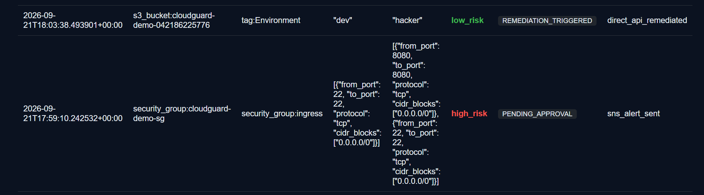
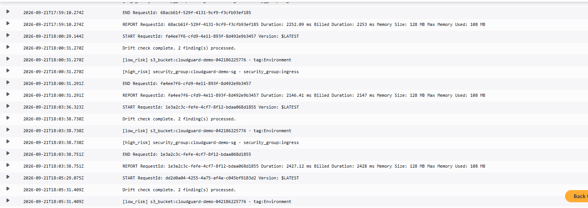

# CloudGuard

**A Serverless Framework for Automated Drift Detection and Risk-Based Remediation in AWS Environments**

CloudGuard continuously detects when live AWS infrastructure drifts away from its declared Terraform configuration, automatically fixes low-risk drift, and escalates high-risk drift for human approval — with a complete audit trail and a public dashboard. Built entirely on real AWS infrastructure (no local simulation), in `ap-south-1`.

## Why

Infrastructure managed through Terraform commonly drifts when someone changes a resource directly in the AWS Console — most dangerously when a security rule is loosened during troubleshooting and never reverted. Existing options are either manual (`terraform plan`, CloudFormation drift detection) or built for enterprise-scale CSPM platforms. CloudGuard fills the gap for a small, explicitly-scoped set of protected resources: continuous detection, risk-tiered response, and zero cost while idle.

## Architecture

```
EventBridge (5 min schedule)
        │
        ▼
Drift Detector Lambda ── queries live state via boto3
        │
        ▼
Compare against desired-state snapshot (S3, captured from `terraform show -json`)
        │
        ▼
Risk classification
        │
   ┌────┴────┐
   ▼         ▼
Low-risk   High-risk
(auto-      (SNS email
remediated   alert,
via direct    held for
boto3 API)    manual review)
   │         │
   └────┬────┘
        ▼
Audit log (DynamoDB) — every finding, before/after, risk tier, action taken
        │
        ▼
Public dashboard (S3 static site + API Gateway → GET /findings)
```

Four protected resources are monitored: an S3 bucket, a DynamoDB table, an IAM role, and a security group.

## Tech Stack

| Layer | Technology |
|---|---|
| IaC / provisioning | Terraform (remote state in S3, locking via DynamoDB) |
| Compute | AWS Lambda (Python 3.12) |
| Scheduling | Amazon EventBridge (5-minute rate) |
| Storage | Amazon S3 (Terraform state, desired-state snapshot, dashboard static site) |
| Database | Amazon DynamoDB (protected resource + audit log) |
| Notifications | Amazon SNS (email alerts for high-risk drift) |
| API | Amazon API Gateway (HTTP API, `GET /findings`) |
| Access control | AWS IAM, least-privilege, resource-scoped policies |
| Frontend | Plain HTML/CSS/JS (no framework) |

## Key Engineering Decision: CodeBuild → Direct API Remediation

Low-risk remediation was originally designed to route through AWS CodeBuild running `terraform apply -target=<resource>`. After fixing an initial IAM permissions gap, remediation consistently failed with `AccountLimitExceededException`, traced via CloudWatch Logs to the AWS account's CodeBuild concurrent-build quota being set to **0** — an account-level limit outside the project's control (AWS Support quota-increase request remained pending through submission).

Rather than ship non-functional remediation, the logic was re-engineered around narrowly-scoped, direct boto3 API calls:
- `s3.put_bucket_tagging()` — restores drifted tags
- `dynamodb.create_table()` — recreates a deleted table using the exact schema from the Terraform config

IAM policies were extended with only the minimum permissions required for each call. The audit log's `action_taken` field records `direct_api_remediated` so the trail distinguishes this path from the abandoned CodeBuild path. The original CodeBuild infrastructure was deliberately left in place in case the pending quota increase is later approved.

## Risk Classification

| Risk Tier | Resource / Field | Behaviour |
|---|---|---|
| Low | S3 tag drift, DynamoDB table deletion | Auto-remediated via direct API call |
| High | Security group ingress/egress drift, IAM role deletion | Left unmodified; SNS email alert; `PENDING_APPROVAL` in audit log |

## Testing & Results

Verified against live AWS infrastructure, not a simulation:

| Scenario | Detected? | Outcome |
|---|---|---|
| S3 tag changed (low-risk) | Yes | Auto-remediated within one 5-min cycle |
| Security group rule added (high-risk) | Yes | SNS alert sent; flagged `PENDING_APPROVAL`, left unmodified |
| DynamoDB table deleted (low-risk) | Yes (as create action) | Implemented & IAM-wired; not exercised live before submission |
| Unmanaged S3 bucket created outside Terraform | No (by design) | Confirms scope is limited to the fixed protected-resource set |

## Screenshots

**Audit log — low-risk auto-remediation vs. high-risk escalation:**



**Live detection — CloudWatch logs from the drift-detector Lambda:**



## Documented Limitations

- Only monitors a fixed, explicitly named resource set — no discovery of unmanaged resources
- Audit log reflects that a remediation call *succeeded at the API level*, not independently re-verified against live state
- DynamoDB table-recreation path implemented but not exercised as a live end-to-end test before submission
- Dashboard's `GET /findings` endpoint is currently unauthenticated (documented as a stretch-goal gap)

## Future Scope

- Enumerate all resources of a type (e.g. `s3:ListBuckets`) against an allow-list to catch genuinely unmanaged resources
- Event-driven Lambda on CodeBuild build-state-change events to close the loop if the quota increase is approved
- Extend risk classification to more resource types and drift fields
- Add Cognito or API-key auth to the dashboard endpoint
- Independent post-remediation verification (re-query live state after a fix)
- Dashboard filtering, search, and basic charting over the audit log

## Author

Built by **Brindha Suvarna** — architecture, implementation, and testing (Terraform, Lambda, remediation logic, dashboard).

Submitted as a Cloud Computing minor project at Vishwakarma University, Pune (2026–27), with Prutha Marne and Soham Patil, under the guidance of Dr. Supriya Bhonsale.
